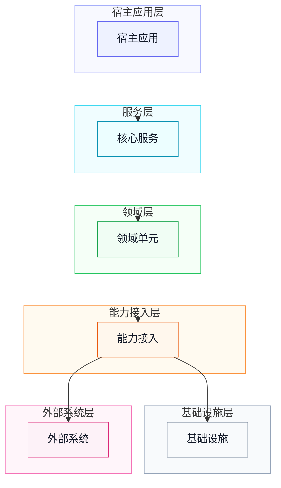
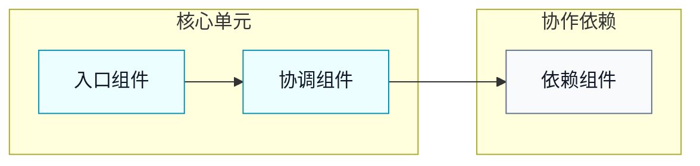
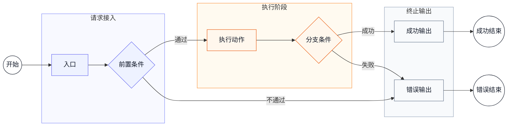
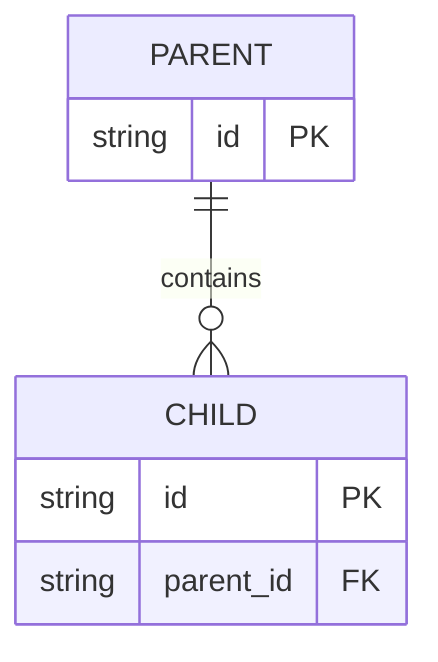

# [名称] 设计

## 1. 架构

### 1.1 系统边界

| 项目 | 说明 |
| --- | --- |
| 范围 |  |
| 入口 |  |
| 外部依赖 |  |
| 非范围 |  |

### 1.2 架构图

箭头表示运行时调用、数据依赖或能力装配方向；细粒度内部流程在 `2. 单元` 中展开。

| 单元 | 职责 | 直接依赖 |
| --- | --- | --- |

## 2. 单元

### 2.1 [核心单元] 组件关系

| 组件 | 职责 | 协作对象 |
| --- | --- | --- |

### 2.2 [核心单元] 运行流程

流程说明：

| 步骤 | 执行者 | 动作 | 输出 |
| --- | --- | --- | --- |

## 3. 单元详情

### 3.1 实体关系

| 来源字段 | 指向字段 | 关系 | 语义 |
| --- | --- | --- | --- |

### 3.2 实体

#### 3.2.1 `[Entity]`

| 字段 | 类型 | 含义 | 关键语义 |
| --- | --- | --- | --- |

### 3.3 值对象与契约

| 对象 | 字段 | 含义 | 关键语义 |
| --- | --- | --- | --- |

### 3.4 关键实现规则

| 规则 | 所属单元 | 实现语义 |
| --- | --- | --- |
