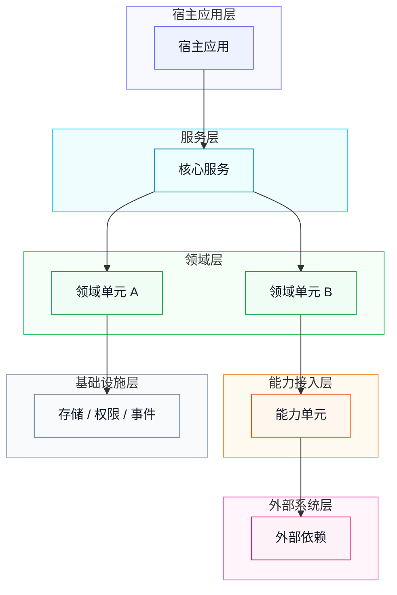

# 架构语法

`架构` 描述整体结构、系统边界、单元关系和外部依赖。它回答：这个设计处在系统哪里，系统有哪些单元，单元之间如何连接。

## SysML 映射

| SysML 语义 | Mermaid 表达 | 用途 |
| --- | --- | --- |
| Block Definition Diagram | `flowchart` / `graph` | 描述系统、单元、外部依赖和组成关系。 |
| Internal Block Diagram | `flowchart` | 描述系统边界内的单元连接和交互端口。 |
| Package Diagram | `graph` | 描述包、模块或分层归属。 |

## 标准结构

```text
## 1. 架构
### 1.1 系统边界
### 1.2 架构图
```

系统边界表：

```md
| 项目 | 说明 |
| --- | --- |
| 范围 | [当前设计覆盖的系统、仓库或能力] |
| 入口 | [调用方、命令、API、任务或事件入口] |
| 外部依赖 | [外部服务、存储、模型、队列或工具] |
| 非范围 | [明确不由当前设计实现但容易混淆的边界] |
```

架构图：



单元职责表：

```md
| 单元 | 职责 | 直接依赖 |
| --- | --- | --- |
| [单元 A] | [正向职责] | [单元 B / 外部依赖] |
```

## 规则

- 架构只描述整体边界、分层结构、主要单元关系和外部依赖；单元内部组件流程由 `单元` 章节表达。
- `架构` 章节默认只生成一张 `架构图`，不要再拆出独立的 `单元关系图`。
- 架构图使用 Mermaid `flowchart TD`，优先采用 `subgraph` 表达层级容器，并在同一张图中保留关键单元关系。
- 架构图应按从上到下的层级排序，推荐层级为：宿主应用层、服务层、领域层、能力接入层、基础设施层、外部系统层。
- 架构图应使用 `classDef/class` 为节点设置层级颜色，并用 `style [SubgraphName]` 给分层容器设置浅色背景；颜色用于表达层级，不用于表达状态。
- 架构图只保留主调用链和关键支撑关系，避免把所有包级依赖都画成连线；细粒度依赖放入单元职责表。
- 箭头方向表示依赖、调用、数据流或能力装配方向，必须在图前或图后说明含义。
- 外部系统应显式标出，避免和内部单元混淆。
- 无关系统默认不出现在文档中。
- Mermaid 节点文本应使用 `["..."]` 或 `{"..."}` 包裹，避免括号、逗号、斜杠、问号等字符导致渲染器解析失败。
- 架构章节中的单元职责表应覆盖图中的主要内部单元；直接依赖写单元名、外部系统名或基础设施名，不写完整函数调用链。
- `非范围` 只写会影响边界理解或实现责任分配的排除项；不要把普通遗漏项写成非范围。
