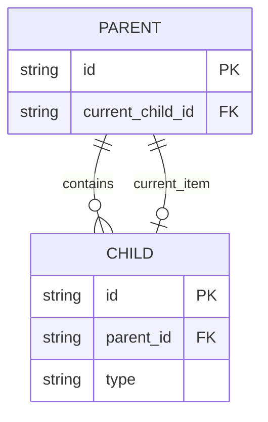

# 实体语法

`实体语法` 用于 `单元详情`，描述实体、字段、实体关系、值对象、接口契约和存储约束。实体关系使用 Mermaid `erDiagram`。

## SysML 映射

| SysML 语义 | Mermaid 表达 | 用途 |
| --- | --- | --- |
| Block Definition Diagram | `erDiagram` / 字段表 / 契约表 | 描述实体、字段、枚举、值对象和接口契约。 |
| Association | `erDiagram` 关系线 | 描述实体之间的引用、所有权和基数。 |
| Parametric Diagram | 表格 | 描述字段约束、派生规则和关键存储语义。 |

## E-R



E-R 应包含：

- 核心实体名称。
- 实体字段；字段较多时优先保证主键、外键、关系类型、状态类型和关键存储字段清晰可读。
- 主键、外键、唯一约束和必要索引字段。
- 关系基数和关系标签。
- 当实体存在自关联或多条关系指向同一实体时，避免只依赖自环线表达关系；应在图后增加关系说明表，明确 `来源字段 -> 指向字段`。
- 字段默认值、空值语义、派生规则和详细存储语义仍由字段表承接。

关系说明表：

```md
| 来源字段 | 指向字段 | 关系 | 语义 |
| --- | --- | --- | --- |
| `CHILD.parent_id` | `PARENT.id` | 多对一 | 子实体通过 parent_id 指向父实体。 |
```

## 标准结构

```text
## 3. 单元详情
### 3.1 实体关系
### 3.2 实体
### 3.3 值对象与契约
### 3.4 关键实现规则
```

`实体关系` 只放持久化实体或拥有稳定存储语义的核心记录；`值对象与契约` 放配置、DTO、事件、请求响应、工具协议、枚举和值对象；`关键实现规则` 放实现时必须保持的跨实体或跨契约语义。

## 实体字段表

```md
#### 3.2.1 `[Entity]`

| 字段 | 类型 | 含义 | 关键语义 |
| --- | --- | --- | --- |
| ID | string | 唯一标识 | 主键 / 必填 |
| Type | enum | 类型 | [枚举值] |
```

## 值对象与契约表

```md
| 对象 | 字段 | 含义 | 关键语义 |
| --- | --- | --- | --- |
| [ValueObject] | [FieldA, FieldB] | [对象用途] | [必填、默认值、派生、生命周期或调用约束] |
```

## 关键实现规则表

```md
| 规则 | 所属单元 | 实现语义 |
| --- | --- | --- |
| [规则名] | [单元或模块] | [实现时必须保持的行为、约束或异常语义] |
```

## 规则

- 只列影响行为、契约或存储的字段。
- E-R 图可以列出实体字段；字段较多时仍应保证关系线和关键字段可读。
- 自关联关系必须在关系说明表中说明外键指向，例如 `SESSION.parent_session_id -> SESSION.id`。
- enum 必须写出可选值。
- 默认值、空值语义、唯一性和索引应写入约束。
- DTO、配置、事件、请求响应、工具参数、模型元数据等非持久化对象默认写入 `值对象与契约`；只有当它们具有独立持久化身份或核心存储语义时，才作为实体进入 E-R。
- 实体关系和字段表应互相印证，字段约束需要在表格中明确表达。
- `实体` 小节优先按实体拆分为 `####` 子节；每个实体字段表使用 `字段 / 类型 / 含义 / 关键语义` 四列。
- `值对象与契约` 表的字段列可以列出一组关键字段，不需要逐字段展开到实体字段表粒度；重点写调用契约、默认值、派生规则和实现影响。
- `关键实现规则` 必须是可执行约束，能指导编码、测试或评审；不要写泛泛而谈的设计愿望。
