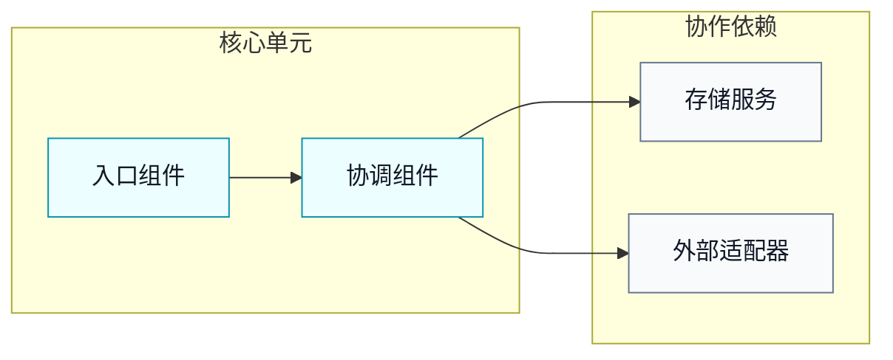
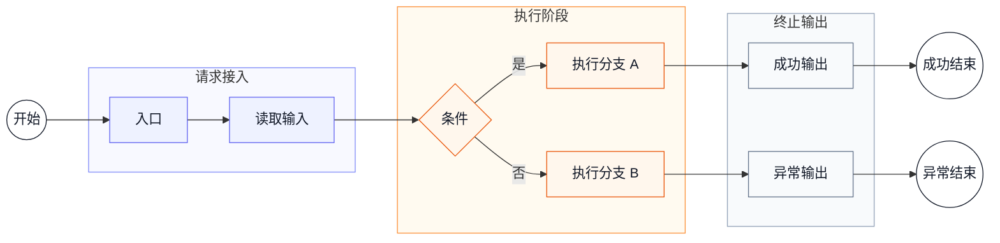
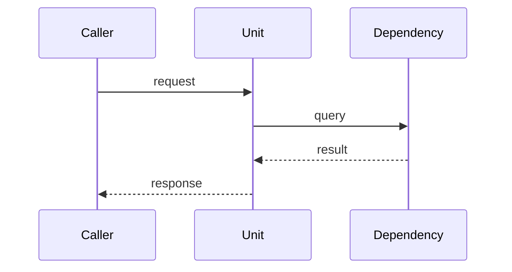

# 流程语法

`流程语法` 用于 `单元`，描述单元内部的运行时行为、组件协作、调用链、分支和异常路径。流程图使用 Mermaid。

## SysML 映射

| SysML 语义 | Mermaid 表达 | 用途 |
| --- | --- | --- |
| Activity Diagram | `flowchart` | 描述活动、分支、合并、回环和终止输出。 |
| Sequence Diagram | `sequenceDiagram` | 描述组件之间的调用顺序和返回关系。 |
| Use Case Flow | 步骤表 | 描述入口、执行者、动作和输出。 |

## Flowchart

组件关系图用于说明单元内部的协作结构，优先使用 `subgraph` 按职责分组，避免把运行流程分支画进组件关系图。组件关系图应暴露实现时真正需要协调的入口组件、协调组件、核心处理组件和关键依赖；不要只画笼统的“服务、数据库、外部系统”。



运行流程图用于说明入口、分支、回环、输出和异常路径。



流程图应包含：

- 明确的 `开始` 节点。
- 入口动作。
- 关键组件或执行者。
- 分支条件。
- 回环或重试。
- 输出、状态变化、事件或错误。
- 一个或多个明确结束节点，例如 `成功结束`、`取消结束`、`错误结束`。

## 图下说明

每张运行流程图下方都应紧跟图下说明，避免图中短节点承载过多实现语义。图下说明优先使用步骤表，必要时补充节点语义表或异常路径表。

步骤表用于把流程图中的阶段、节点和分支翻译成可实现动作：

```md
| 步骤 | 执行者 | 动作 | 输出 |
| --- | --- | --- | --- |
| 1 | [入口组件] | [读取输入] | [初始上下文] |
| 2 | [协作组件] | [执行规则] | [中间结果] |
| 3 | [入口组件] | [返回结果] | [输出] |
```

当流程图节点使用短名、缩写或聚合节点时，增加节点语义表：

```md
| 节点 | 完整语义 | 实现影响 |
| --- | --- | --- |
| [短节点] | [完整名称或业务含义] | [需要保持的调用、状态、存储或错误语义] |
```

当异常路径会影响实现、权限、状态或持久化结果时，增加异常路径表：

```md
| 路径 | 触发条件 | 处理结果 |
| --- | --- | --- |
| [错误结束] | [触发条件] | [返回值、事件、状态或持久化变化] |
```

## Sequence

当需要强调多个组件之间的调用顺序时，使用 Mermaid `sequenceDiagram`。



## 规则

- 流程属于 `单元`，用于描述单元内部运行时行为。
- `组件关系` 图表达协作结构，使用 `flowchart LR` 或 `flowchart TD` 均可，优先按职责用 `subgraph` 分组。
- `组件关系` 图只画主要组件和协作依赖，不画 busy、success/error、tool calls 等运行分支；运行分支放入后续流程图。
- `运行流程` 图优先按阶段使用 `subgraph` 分组，例如请求接入、上下文准备、执行循环、权限处理、终止输出。
- 阶段化流程图应给阶段容器和节点设置样式，确保读者能区分接入、上下文、执行、权限、终止等阶段。
- 每个流程必须有明确开始节点、入口动作和终止输出；存在多个终止路径时，分别标出结束节点。
- 每个分支必须写出选择条件。
- 异常路径会影响实现时，应作为流程分支出现。
- 图表达结构，图下说明表达精确动作、节点语义、输出和异常处理。
- 每张运行流程图后必须至少有一个步骤表；如果图中存在短名、聚合节点或实现敏感异常路径，应再补充节点语义表或异常路径表。
- 图下说明必须和流程图中的节点、分支、终止输出互相印证；不要出现图中没有的关键步骤，也不要让图中关键分支在说明中缺席。
- `sequenceDiagram` 用于表达跨组件调用顺序；如果时序图已经清晰，不要为了统一视觉风格强行改成 flowchart。
- Mermaid 节点文本应使用 `["..."]` 或 `{"..."}` 包裹，避免括号、逗号、斜杠、问号等字符导致渲染器解析失败。
- 同一单元存在多个关键场景时，可以拆为多个流程小节；每个流程小节都应有自己的图和步骤表，避免把不相关场景塞进一张复杂图。
- 单元章节的小节标题应表达对象和视角，例如 `[单元] 组件关系`、`[单元] 运行流程`、`[能力] 装配与权限流程`。
- 流程图中可以使用英文分支标签或本地语言分支标签，但同一张图内应保持一致。
