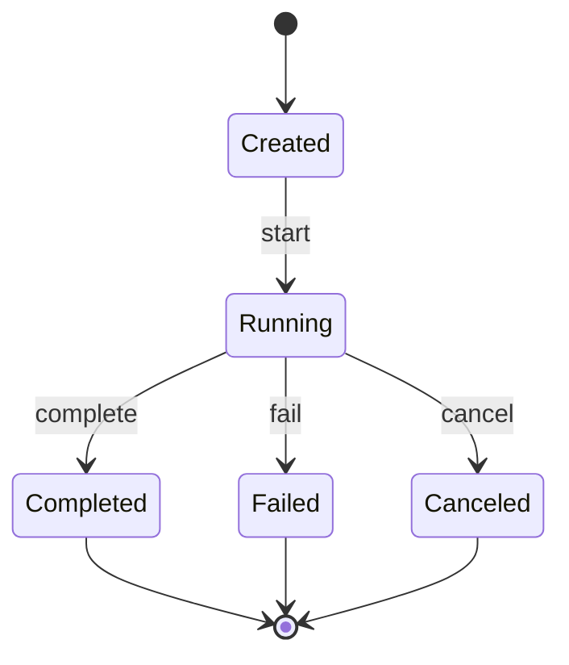

# 状态语法

`状态语法` 用于 `单元`，描述生命周期、状态迁移、触发条件和终态。状态图使用 Mermaid `stateDiagram-v2`。

## SysML 映射

| SysML 语义 | Mermaid 表达 | 用途 |
| --- | --- | --- |
| State Machine Diagram | `stateDiagram-v2` | 描述状态、迁移、触发事件和终态。 |
| State Invariant | 状态表 | 描述状态含义、进入条件和退出条件。 |

## State Diagram



## 状态表

```md
| 状态 | 含义 | 可进入条件 | 可退出条件 |
| --- | --- | --- | --- |
| Created | [已创建] | [初始化成功] | [start] |
| Running | [运行中] | [start] | [complete / fail / cancel] |
```

## 规则

- 状态图应包含初始状态和终止状态。
- 每条迁移应有触发条件或事件名称。
- 错误、取消、超时等会影响实现的路径应显式出现。
- 状态图属于 `单元` 章节；状态字段、持久化状态值和状态不变量属于 `单元详情` 的实体字段、值对象与契约或关键实现规则。
- 状态表只列影响实现或评审的状态，不把临时 UI 展示态或无实现约束的中间态写入标准设计文档。
- 当流程图已经完整表达生命周期且状态数量较少时，可以不额外生成状态图；改用流程图和关键实现规则承接。
